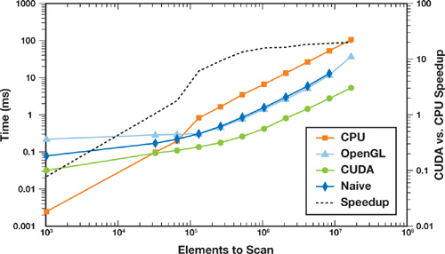

# CUDA Blelloch Scan

Work-efficient implmentation of Blelloch scan for finding prefix sum with parallelized multi-threaded algorithm in $O(\log{N})$ steps.

GPU version is slower at the moment than CPU as the memory transfers are expensive and much larger N is necessary to make the optimizations worthwhile.

## Performance Comparison

[Read for more](https://developer.nvidia.com/gpugems/gpugems3/part-vi-gpu-computing/chapter-39-parallel-prefix-sum-scan-cuda)

TODO:
- [X] Arrays of arbitrary size
- [X] Benchmarking
- [ ] Addressing memory bank conflict
- [ ] Further optimizations (e.g. loading values in float4)